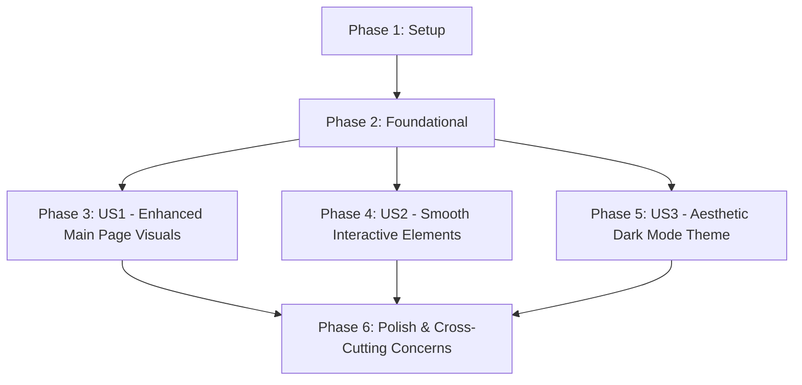

# Tasks for Frontend UI/UX Enhancement

**Branch**: `001-enhance-frontend-ui`
**Spec**: `specs/001-enhance-frontend-ui/spec.md`
**Plan**: `specs/001-enhance-frontend-ui/plan.md`
**Date**: 2025-12-04

## Summary

This document outlines the implementation tasks for enhancing the frontend UI/UX, broken down by user story and prioritized accordingly. The tasks cover redesigning the main page, implementing smooth animations and micro-interactions, and refining the dark mode theme.

## Implementation Strategy

The implementation will follow an iterative approach, focusing on delivering the highest priority user stories first (P1), followed by P2. Each user story is designed to be independently testable. Development will proceed incrementally, allowing for continuous feedback and validation.

## Phase 1: Setup

This phase focuses on ensuring the development environment is correctly configured and core styling dependencies are in place to support the UI/UX enhancements.

- [x] T001 Initialize Tailwind CSS for Docusaurus theme overrides if not already configured in `frontend/book/tailwind.config.js`
- [x] T002 Verify Docusaurus theme customization setup in `frontend/book/docusaurus.config.ts` to allow for component and style overrides.
- [x] T003 Review existing `frontend/book/src/css/custom.css` for any conflicting styles and plan for migration to Tailwind utilities where appropriate.

## Phase 2: Foundational

This phase establishes core design principles and global styles that will underpin all UI/UX enhancements.

- [x] T004 Define a consistent typography scale and font families in `frontend/book/tailwind.config.js` and `frontend/book/src/css/custom.css`.
- [x] T005 Establish a color palette (light and dark mode) ensuring sufficient contrast and accessibility guidelines are met in `frontend/book/tailwind.config.js`.
- [x] T006 Implement a global base layout structure for all pages, ensuring responsiveness, in `frontend/book/src/theme/Layout/index.tsx` (or similar core layout component).

## Phase 3: User Story 1 - Enhanced Main Page Visuals (Priority: P1)

**Goal**: The main page has a modern, visually appealing, and responsive design, providing an engaging and pleasant browsing experience.

**Independent Test**: Access the main page on different devices (desktop, tablet, mobile) and verify visual consistency and correct scaling.

- [x] T007 [US1] [P] Redesign the main page hero section (`frontend/book/src/pages/index.tsx`) to be modern and visually appealing using Tailwind CSS.
- [x] T008 [US1] [P] Update the layout and styling of existing sections on the main page (`frontend/book/src/pages/index.tsx`) for a clean and modern look.
- [x] T009 [US1] [P] Implement responsive adjustments for the main page layout (`frontend/book/src/pages/index.tsx`) to ensure optimal viewing on tablet and mobile devices.
- [x] T010 [US1] [P] Adjust typography and spacing on the main page (`frontend/book/src/pages/index.tsx` and related components) for improved readability and visual hierarchy.

## Phase 4: User Story 2 - Smooth Interactive Elements (Priority: P1)

**Goal**: Users experience smooth animations and micro-interactions when interacting with UI elements, making the application feel professional, dynamic, and intuitive.

**Independent Test**: Interact with individual UI elements (buttons, navigation links, interactive cards) and verify smooth transitions and appropriate visual feedback.

- [x] T011 [US2] [P] Implement subtle hover effects for interactive elements (buttons, links, cards) across the site, modifying relevant component files (e.g., `frontend/book/src/components/`, `frontend/book/src/css/custom.css`).
- [x] T012 [US2] [P] Introduce smooth page transition animations (e.g., fade-in, slide) between major routes using Docusaurus API or custom component overrides in `frontend/book/src/theme/Root.tsx`.
- [x] T013 [US2] [P] Implement scroll-triggered fade-in or slide animations for new content entering the viewport, potentially in `frontend/book/src/theme/Root.tsx` or specific page components.
- [x] T014 [US2] [P] Enhance button click animations for a more dynamic and professional feel, modifying global button styles or individual button components.

## Phase 5: User Story 3 - Aesthetic Dark Mode Theme (Priority: P2)

**Goal**: The Dark Mode uses a stylish dark theme color instead of pure black, enhancing aesthetic appeal and reducing eye strain.

**Independent Test**: Toggle between light and dark modes and inspect background colors to confirm a stylish dark theme color is used, not pure black.

- [x] T015 [US3] Identify and replace pure black (`#000000`) background colors with a stylish dark theme color (e.g., `#0f0f14` or `#1a1c1f`) in `frontend/book/tailwind.config.js` and `frontend/book/src/css/custom.css`.
- [x] T016 [US3] Ensure all UI elements (text, icons, cards) maintain clear visibility and appropriate contrast against the new dark mode background, adjusting component styles as needed.
- [x] T017 [US3] Review and adjust color saturation for elements in dark mode to prevent visual vibration, particularly for primary accent colors.

## Phase 6: Polish & Cross-Cutting Concerns

This phase addresses overall quality, performance, and accessibility across the entire feature.

- [x] T018 Conduct a comprehensive review of all implemented UI/UX changes for consistency with chosen design guidelines and overall visual appeal.
- [x] T019 Perform Lighthouse audits to ensure performance goals (SC-002, SC-003) are met, focusing on animation smoothness and responsiveness.
- [x] T020 Verify accessibility of new UI elements and interactions (e.g., keyboard navigation, contrast ratios) and address any identified issues.
- [x] T021 Optimize assets (images, icons) used in the redesigned UI for faster loading times and better performance.

## Dependency Graph

## Parallel Execution Examples

- **Example 1**: Tasks T007 (Redesign hero section), T008 (Update existing sections), T009 (Implement responsive adjustments), and T010 (Adjust typography and spacing) within **Phase 3 (User Story 1)** can be worked on in parallel by different developers, as they focus on distinct parts of the main page.
- **Example 2**: Tasks T011 (Hover effects), T012 (Page transitions), T013 (Scroll animations), and T014 (Button click animations) within **Phase 4 (User Story 2)** can be implemented in parallel, as they address different types of interactive elements and animations.
- **Example 3**: A developer can work on **Phase 3 (User Story 1)**, while another developer simultaneously works on **Phase 5 (User Story 3)**, as these two user stories have minimal direct dependencies (beyond foundational styles).

## Suggested MVP Scope

The Minimum Viable Product (MVP) for this feature would focus on **User Story 1: Enhanced Main Page Visuals**. This would deliver a modern, visually appealing, and responsive main page, providing significant value and a strong first impression. Once User Story 1 is complete and validated, User Story 2 (Smooth Interactive Elements) can be integrated, followed by User Story 3 (Aesthetic Dark Mode Theme).
