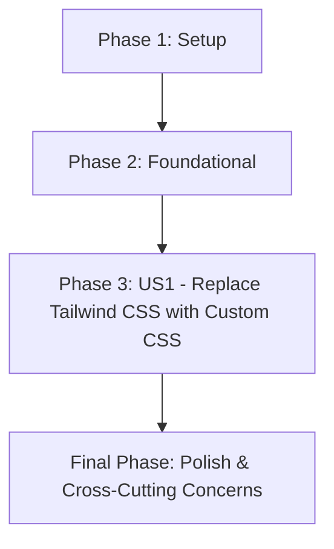

# Tasks for Remove Tailwind CSS

**Branch**: `002-remove-tailwind-css`
**Spec**: `specs/002-remove-tailwind-css/spec.md`
**Plan**: `specs/002-remove-tailwind-css/plan.md`
**Date**: 2025-12-06

## Summary

This document outlines the implementation tasks for removing Tailwind CSS from the frontend and replacing it with custom CSS, ensuring the visual integrity and responsiveness of the application are maintained.

## Implementation Strategy

The implementation will follow a phased approach, starting with the removal of Tailwind CSS dependencies and configuration, followed by a systematic replacement of utility classes with custom CSS. Verification steps are integrated to ensure visual consistency and performance.

## Phase 1: Setup

### Story Goal: Remove Tailwind CSS Infrastructure

#### Independent Test Criteria:
- No Tailwind CSS dependencies are listed in `frontend/book/package.json`.
- Tailwind CSS configuration files are removed or appropriately disabled.

#### Implementation Tasks:
- [x] T001 Remove `tailwindcss`, `postcss`, `autoprefixer` dependencies from `frontend/book/package.json`.
- [x] T002 Delete `frontend/book/postcss.config.js` and `frontend/book/tailwind.config.js`.

## Phase 2: Foundational

### Story Goal: Prepare for Custom CSS Migration

#### Independent Test Criteria:
- A clear understanding of all Tailwind CSS utility classes used across the project is documented.
- Initial custom CSS structure is established in `frontend/book/src/css/custom.css`.

#### Implementation Tasks:
- [x] T003 Audit all `.tsx` and `.mdx` files in `frontend/book/src/` for Tailwind CSS utility classes and document their corresponding visual effects or required custom styles.
- [x] T004 Create a base `frontend/book/src/css/variables.css` file for defining CSS custom properties (e.g., colors, typography, spacing).

## Phase 3: User Story 1 - Replace Tailwind CSS with Custom CSS (P1)

### Story Goal: Frontend Styling Migrated to Custom CSS

#### Independent Test Criteria:
- The frontend application builds and runs without styling errors.
- Visual appearance and responsiveness are identical to the pre-Tailwind CSS state.
- No Tailwind CSS utility classes are found in the rendered HTML.

#### Implementation Tasks:
- [x] T005 [P] [US1] Replace Tailwind CSS utility classes with custom CSS classes in `frontend/book/src/pages/index.tsx`, linking to `frontend/book/src/css/custom.css` and `frontend/book/src/css/variables.css`.
- [x] T006 [P] [US1] Replace Tailwind CSS utility classes with custom CSS classes in components under `frontend/book/src/components/`, linking to `frontend/book/src/css/custom.css` and `frontend/book/src/css/variables.css`.
- [x] T007 [P] [US1] Replace Tailwind CSS utility classes with custom CSS classes in Docusaurus markdown files (e.g., `frontend/book/src/pages/book/*.mdx` and `frontend/book/docs/**/*.md` or similar), linking to `frontend/book/src/css/custom.css` and `frontend/book/src/css/variables.css`.
- [x] T008 [US1] Refactor and centralize all newly created custom CSS rules into `frontend/book/src/css/custom.css` and `frontend/book/src/css/variables.css`.

## Final Phase: Polish & Cross-Cutting Concerns

### Story Goal: Ensure Quality, Performance, and Accessibility

#### Independent Test Criteria:
- No visual regressions or layout issues.
- Performance metrics are maintained.

#### Implementation Tasks:
- [x] T009 Perform thorough visual inspection and responsiveness testing across all pages and screen sizes to ensure consistent appearance and behavior.
- [x] T010 Conduct Lighthouse audits (performance, accessibility, SEO) to confirm no degradation in scores compared to the baseline.

## Dependency Graph

## Parallel Execution Examples

- **Example 1**: Tasks T005, T006, and T007 within **Phase 3 (User Story 1)** can be worked on in parallel by different developers, as they focus on replacing Tailwind classes in distinct sets of files (`index.tsx`, components, and markdown files).

## Suggested MVP Scope

The Minimum Viable Product (MVP) for this feature would encompass **Phase 1: Setup**, **Phase 2: Foundational**, and **Phase 3: User Story 1 - Replace Tailwind CSS with Custom CSS**. This delivers the core functionality of removing Tailwind CSS and migrating to custom CSS, ensuring the application remains visually and functionally intact. Once the migration is complete and validated, the **Final Phase: Polish & Cross-Cutting Concerns** can be addressed to optimize and ensure overall quality.
